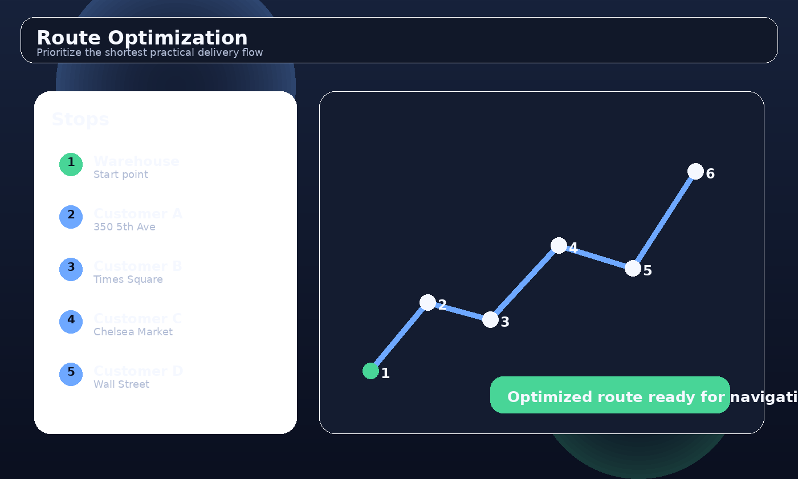
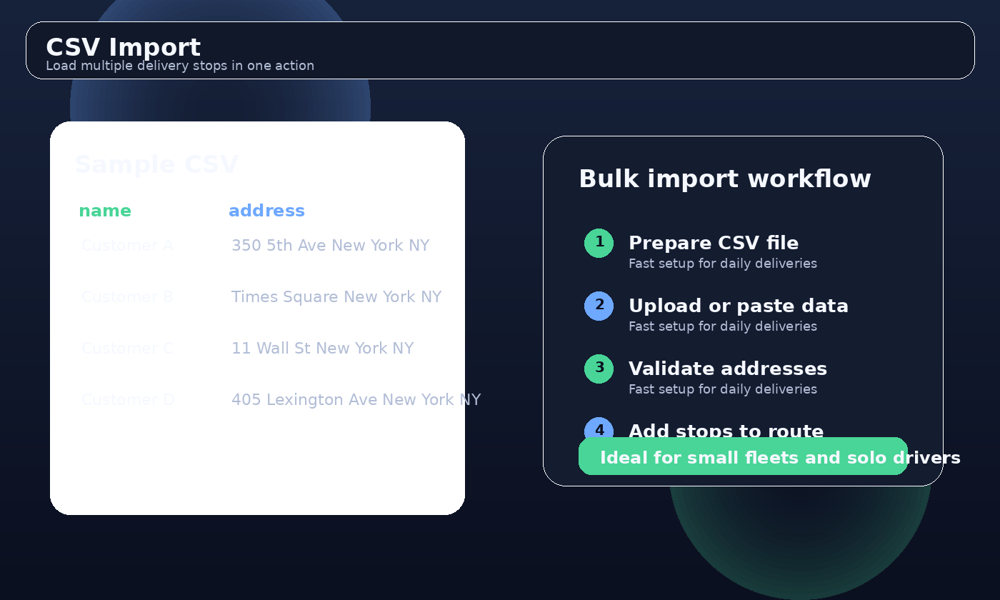

# Smart Delivery Route Planner

⭐ If you like this project, please give it a star!

🚚 **Plan delivery routes in seconds.**

Smart Delivery Route Planner is a lightweight web app for delivery drivers and couriers.
Import stops from CSV, automatically optimize the route, adjust it manually with drag & drop, and launch Google Maps navigation instantly.

Works directly in the browser and can be installed on your phone as a **PWA (Progressive Web App)**.

---

## 🌍 Live Demo

👉 https://tookamura9648-ai.github.io/smart-delivery-route-planner/

Open the demo on your smartphone and try planning a delivery route.

---

## ✨ Features

* 📄 **CSV Import** – Add many delivery stops at once
* ⚡ **Auto Route Optimization** – Calculate an efficient delivery order
* ✋ **Manual Reordering** – Drag & drop stops to adjust the route
* 🧭 **Google Maps Navigation** – Launch navigation with one tap
* 📱 **Mobile Friendly** – Works on smartphone and desktop
* 📦 **PWA Installable** – Add the app to your home screen
* 🎤 **Voice Address Input** – Quickly add stops by voice

---

## 🖼 Screenshots

### Route Optimization



### CSV Import



---

## 🚀 Quick Start

Clone the repository

```
git clone https://github.com/tookamura9648-ai/smart-delivery-route-planner
```

Open

```
index.html
```

in your browser.

No installation required.

---

## 📄 CSV Format

Example CSV file:

```
name,address
Customer A,350 5th Ave New York
Customer B,Times Square New York
Customer C,Brooklyn Bridge New York
```

Import the CSV file to add multiple delivery stops instantly.

---

## 🛠 Tech Stack

* Leaflet
* OpenStreetMap
* JavaScript
* Progressive Web App (PWA)

---

## 👨‍💼 Use Cases

* Delivery drivers
* Courier services
* Small logistics teams
* Independent contractors
* Field service workers

---

## 📜 License

MIT License

